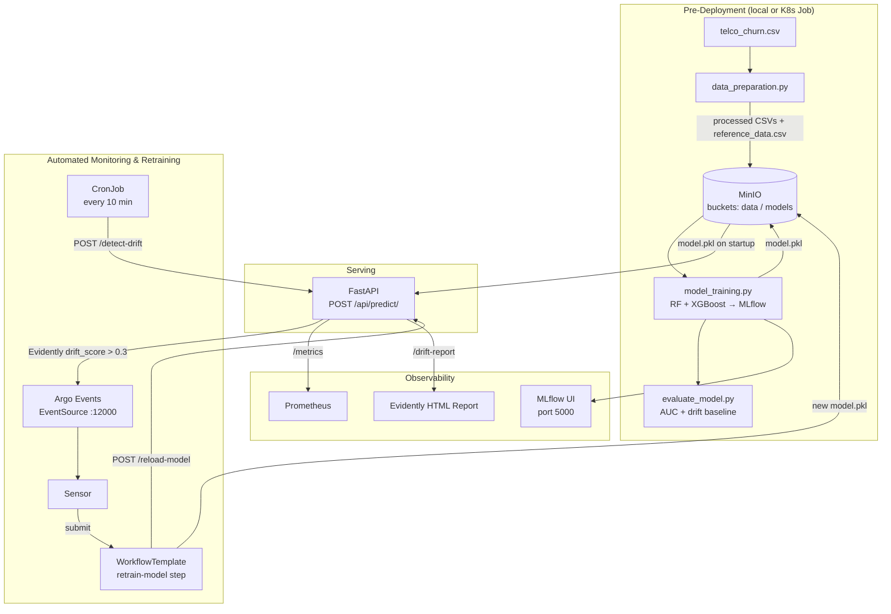

# MLOps Pipeline — Hands-On Learning Guide

> **How to use this guide:** Read each section, then immediately run the
> commands in your terminal. Every concept is paired with a concrete test
> so you understand not just *what* the pipeline does but *why* each piece
> exists and *how* to verify it works.

---

## Table of Contents

1. [What You Will Learn](#1-what-you-will-learn)
2. [Repository Map](#2-repository-map)
3. [Architecture & Data Flow](#3-architecture--data-flow)
4. [Prerequisites](#4-prerequisites)
5. [Stage 0 — Local Python Environment](#5-stage-0--local-python-environment)
6. [Stage 1 — Run MinIO Locally](#6-stage-1--run-minio-locally)
7. [Stage 2 — Data Preparation](#7-stage-2--data-preparation)
8. [Stage 3 — Model Training & MLflow](#8-stage-3--model-training--mlflow)
9. [Stage 4 — Model Evaluation](#9-stage-4--model-evaluation)
10. [Stage 5 — FastAPI Locally](#10-stage-5--fastapi-locally)
11. [Stage 6 — Kubernetes Cluster (kind)](#11-stage-6--kubernetes-cluster-kind)
12. [Stage 7 — Deploy to Kubernetes](#12-stage-7--deploy-to-kubernetes)
13. [Stage 8 — Automated Drift Detection & Retraining](#13-stage-8--automated-drift-detection--retraining)
14. [Argo Workflows & Events Deep-Dive](#14-argo-workflows--events-deep-dive)
15. [Makefile Quick Reference](#15-makefile-quick-reference)
16. [Troubleshooting](#16-troubleshooting)
17. [Resources](#17-resources)

---

## 1. What You Will Learn

By working through this repository you will gain practical experience with:

| Domain | Technologies |
|---|---|
| **DataOps** | pandas, scikit-learn, feature engineering, train/val/test splitting |
| **MLOps** | MLflow experiment tracking, model versioning, joblib serialisation |
| **Model Monitoring** | Evidently AI drift detection, Prometheus metrics |
| **Object Storage** | MinIO (S3-compatible), boto3 |
| **API Serving** | FastAPI, Uvicorn, Pydantic validation |
| **Containers** | Docker, multi-stage builds, Conda environments |
| **Orchestration** | Kubernetes (kind), Deployments, Jobs, CronJobs |
| **GitOps / Event-Driven** | Argo Workflows, Argo Events, webhook triggers |

**The big picture:** A CronJob periodically checks whether the production data
distribution has drifted from the training distribution. If it has, an
automated retraining pipeline fires, replaces the model in MinIO, and hot-swaps
it in the live API — all without human intervention.

---

## 2. Repository Map

```
MLOps-Pipeline/
├── application/src/
│   ├── create_app.py       # FastAPI factory: all endpoints wired together
│   ├── create_service.py   # Model loading & MinIO download logic
│   ├── drift_detection.py  # Evidently AI drift report generation
│   └── predict.py          # POST /api/predict/ router
│
├── config/
│   ├── process.yaml        # Feature lists, split ratios (edit here to change features)
│   └── kind-config.yaml    # kind cluster definition
│
├── data/raw/
│   └── telco_churn.csv     # Source dataset (IBM Telco Customer Churn)
│
├── docker/
│   ├── fastapi/Dockerfile       # API service image
│   ├── model/Dockerfile         # Training / retraining image
│   ├── mlserver/Dockerfile      # MLServer + MLflow UI image
│   └── drift-detection/Dockerfile
│
├── k8s/
│   ├── api/fastapi-depl.yaml    # FastAPI Deployment + Service
│   ├── minio/minio_depl.yml     # MinIO Deployment + Service
│   ├── mlserver/mlserver.yaml   # MLServer + MLflow Deployment + Service
│   ├── drift/drift-job.yaml     # CronJob: calls /detect-drift every 10 min
│   ├── model/model-train-job.yaml  # One-off initial training Job
│   └── argo/
│       ├── webhook-eventsource.yaml   # HTTP webhook → Argo event
│       ├── drift-detection-sensor.yaml # Event → WorkflowTemplate submission
│       ├── workflow-template.yaml     # Retrain + notify-reload steps
│       └── serviceaccount/            # RBAC for Argo pods
│
├── requirements/
│   ├── requirements.app.txt     # FastAPI service dependencies
│   ├── requirements.dev.txt     # Linting, testing tools
│   ├── requirements.retrain.txt # Training / retraining dependencies
│   └── requirements.drift.txt   # Standalone drift detection
│
├── scripts/
│   ├── data_preparation.py      # Clean, engineer, split, upload to MinIO
│   ├── run_data_preparation.py  # CLI wrapper for data_preparation.py
│   ├── model_training.py        # Train RF + XGBoost, log to MLflow
│   ├── evaluate_model.py        # AUC, classification report, drift baseline
│   └── retrain_model.py         # Automated retraining loop (drift → retrain)
│
├── tests/
│   └── test_data_preparation.py
│
├── makefile                     # Shortcuts for every pipeline step
└── README.md                    # You are here
```

---

## 3. Architecture & Data Flow



**Key insight:** Nothing in the retraining loop requires a human. The only
manual steps are the initial cluster setup and the first training run.

---

## 4. Prerequisites

Install these tools before anything else. Verified versions are listed; newer
minor versions are usually fine.

### Required on your workstation

| Tool | Min version | Install |
|---|---|---|
| Python | 3.9 | `conda` or `pyenv` |
| Docker Desktop / Docker Engine | 24.x | https://docs.docker.com/get-docker/ |
| kind | 0.22 | `brew install kind` / `go install sigs.k8s.io/kind@latest` |
| kubectl | 1.28 | https://kubernetes.io/docs/tasks/tools/ |
| Argo CLI | 3.5 | https://github.com/argoproj/argo-workflows/releases |
| Argo Events CLI | 1.9 | installed via `kubectl` manifests |
| make | any | pre-installed on macOS/Linux |
| curl | any | pre-installed on macOS/Linux |

### Verify all tools are installed

```bash
docker --version
kind --version
kubectl version --client
argo version
python --version
```

---

## 5. Stage 0 — Local Python Environment

### Why a dedicated environment?

The training stack (scikit-learn, XGBoost, MLflow) and the API stack (FastAPI,
Evidently) have overlapping but sometimes conflicting dependencies. Isolating
them in a Conda environment prevents version conflicts.

### Set up

```bash
conda create --name mlops_env python=3.9 -y
conda activate mlops_env

# Install all requirement sets
pip install -r requirements/requirements.retrain.txt
pip install -r requirements/requirements.app.txt
pip install -r requirements/requirements.dev.txt
```

### ✅ Test: verify imports

```bash
python -c "import mlflow, sklearn, xgboost, evidently, fastapi; print('All imports OK')"
```

---

## 6. Stage 1 — Run MinIO Locally

MinIO is S3-compatible object storage. We run it locally first to develop and
test without needing a Kubernetes cluster.

### Start MinIO with Docker

```bash
docker run -d \
  --name minio-local \
  -p 9000:9000 \
  -p 9001:9001 \
  -e MINIO_ROOT_USER=minioadmin \
  -e MINIO_ROOT_PASSWORD=minioadmin \
  minio/minio server /data --console-address ":9001"
```

### ✅ Test: open the console

Navigate to **http://localhost:9001** — log in with `minioadmin / minioadmin`.
You should see an empty bucket list. After running data preparation you will see
`data` and `models` buckets appear here.

### Verify with boto3

```bash
python - <<'EOF'
import boto3
s3 = boto3.client("s3", endpoint_url="http://localhost:9000",
                  aws_access_key_id="minioadmin",
                  aws_secret_access_key="minioadmin")
print("Buckets:", [b["Name"] for b in s3.list_buckets()["Buckets"]])
EOF
```

Expected output: `Buckets: []`

---

## 7. Stage 2 — Data Preparation

### What this stage does

`scripts/data_preparation.py` ingests `data/raw/telco_churn.csv` and:

1. Drops duplicates and NaN rows
2. Coerces `TotalCharges` to numeric
3. Bins `tenure` into `Tenure_Bin` (feature engineering)
4. Reads feature lists and split ratios from `config/process.yaml`
5. Splits: **70% train | 15% val | 15% test** (stratified)
6. Saves CSVs locally to `data/processed/`
7. Uploads all splits + `reference_data.csv` to MinIO bucket `data`

### Run it

```bash
# Make sure MinIO is running first (Stage 1)
make run-data-preparation
# Or directly:
python scripts/run_data_preparation.py \
  --data-path data/raw/telco_churn.csv \
  --config-path config/process.yaml \
  --output-dir data/processed
```

### ✅ Test: check outputs

```bash
# Local files
ls data/processed/
# Expected: X_train.csv  y_train.csv  X_val.csv  y_val.csv  X_test.csv  y_test.csv  reference_data.csv

# MinIO contents (go to http://localhost:9001 → bucket: data)
python - <<'EOF'
import boto3
s3 = boto3.client("s3", endpoint_url="http://localhost:9000",
                  aws_access_key_id="minioadmin",
                  aws_secret_access_key="minioadmin")
for obj in s3.list_objects(Bucket="data")["Contents"]:
    print(obj["Key"])
EOF
```

### ✅ Test: run unit tests

```bash
python -m pytest tests/test_data_preparation.py -v
```

### Experiment: change features

Open `config/process.yaml`, remove `TotalCharges` from `numeric_features`, and
re-run. Compare the resulting `X_train.csv` shapes. Then undo the change.

---

## 8. Stage 3 — Model Training & MLflow

### What this stage does

`scripts/model_training.py`:

1. Loads processed splits from `data/processed/`
2. Builds a `ColumnTransformer` (StandardScaler for numerics, OneHotEncoder for
   categoricals)
3. Trains two sklearn Pipelines: **RandomForest** and **XGBoost**
4. Logs every run to MLflow (params, metrics, model + signature)
5. Selects the winner by validation **ROC-AUC**
6. Saves `models/best_model/model.pkl` locally with joblib
7. Uploads `model.pkl` to MinIO bucket `models`

### Start MLflow tracking server

```bash
# In a dedicated terminal — leave it running throughout this session
mlflow server --host 127.0.0.1 --port 8080
```

### Run training

```bash
make run-model-training
# Or directly:
python scripts/model_training.py
```

### ✅ Test: inspect MLflow UI

Open **http://127.0.0.1:8080** → experiment `Churn_Prediction` → compare the
two runs. You should see:
- `model` parameter: RandomForest vs XGBoost
- `auc` metric: typically 0.82–0.85

### ✅ Test: verify model.pkl exists

```bash
ls -lh models/best_model/model.pkl
# Check it loads correctly
python -c "import joblib; m = joblib.load('models/best_model/model.pkl'); print(type(m))"
```

### ✅ Test: verify MinIO upload

```bash
python - <<'EOF'
import boto3
s3 = boto3.client("s3", endpoint_url="http://localhost:9000",
                  aws_access_key_id="minioadmin",
                  aws_secret_access_key="minioadmin")
for obj in s3.list_objects(Bucket="models")["Contents"]:
    print(obj["Key"])
EOF
# Expected: best_model/model.pkl  and  reference_data.csv
```

---

## 9. Stage 4 — Model Evaluation

### What this stage does

`scripts/evaluate_model.py`:

1. Loads `models/best_model/model.pkl`
2. Evaluates on `data/processed/X_test.csv` → computes ROC-AUC + classification report
3. Saves `models/evaluation_reports/classification_report.txt`
4. Runs Evidently `DataDriftPreset` comparing X_test vs X_train
5. Saves `models/evaluation_reports/data_drift_report.html`

### Run it

```bash
make run-evaluate-model
# Or directly:
python scripts/evaluate_model.py
```

### ✅ Test: view reports

```bash
cat models/evaluation_reports/classification_report.txt
# Open the drift report in your browser:
xdg-open models/evaluation_reports/data_drift_report.html   # Linux
# open models/evaluation_reports/data_drift_report.html     # macOS
```

The drift report for test vs train should show **low drift** (< 0.1). If it's
high, something is wrong with the data split.

---

## 10. Stage 5 — FastAPI Locally

### What this stage does

`application/src/create_app.py` builds a FastAPI app that:
- Loads `model.pkl` from disk (downloads from MinIO if missing)
- Serves `POST /api/predict/` for churn probability
- Serves `POST /detect-drift` to run Evidently on demand
- Serves `POST /simulate-drift` to inject artificial distribution shift
- Serves `GET /drift-report` to view the latest HTML report
- Serves `GET /metrics` for Prometheus scraping
- Serves `POST /reload-model` to hot-swap the in-memory model

### Run it

```bash
make run-fastapi
# Or directly:
uvicorn application.src.create_app:create_app --factory --host 0.0.0.0 --port 8000 --reload
```

### ✅ Test 1: Swagger UI

Open **http://localhost:8000/docs** — you'll see all endpoints with example
payloads. Use the **Try it out** button for interactive testing.

### ✅ Test 2: Make a prediction

```bash
curl -s -X POST http://localhost:8000/api/predict/ \
  -H "Content-Type: application/json" \
  -d '{
    "tenure": 12,
    "MonthlyCharges": 70.5,
    "TotalCharges": 850.0,
    "gender": "Male",
    "Partner": "No",
    "Dependents": "No",
    "PhoneService": "Yes",
    "InternetService": "Fiber optic",
    "Contract": "Month-to-month",
    "PaymentMethod": "Credit card (automatic)",
    "Tenure_Bin": "1-2 yrs"
  }' | python -m json.tool
# Expected: {"churn_probability": 0.XX}
```

### ✅ Test 3: Health check

```bash
curl http://localhost:8000/health
# Expected: {"status":"healthy"}
```

### ✅ Test 4: Trigger drift detection

```bash
curl -s -X POST http://localhost:8000/detect-drift | python -m json.tool
# Expected: {"status":"success","drift_score":X.XX,"report_path":"/tmp/data_drift_report.html"}
```

### ✅ Test 5: Simulate drift then detect

```bash
# Inject numerical shift
curl -s -X POST http://localhost:8000/simulate-drift \
  -H "Content-Type: application/json" \
  -d '{"drift_type": "numerical_shift"}' | python -m json.tool

# Now run detection — score should be higher
curl -s -X POST http://localhost:8000/detect-drift | python -m json.tool

# View the HTML report
open http://localhost:8000/drift-report
```

### ✅ Test 6: Prometheus metrics

```bash
curl http://localhost:8000/metrics
# Look for: data_drift_score and drift_detected lines
```

---

## 11. Stage 6 — Kubernetes Cluster (kind)

### What is kind?

**Kubernetes IN Docker** — runs a full K8s cluster using Docker containers as
nodes. Perfect for local development without a cloud account.

### Create the cluster

```bash
kind create cluster --name mlops-demo --config kind-config.yaml
# Verify:
kubectl cluster-info --context kind-mlops-demo
kubectl get nodes
# Expected: control-plane (Ready) + worker (Ready)
```

### Create all namespaces

```bash
kubectl create namespace mlserver
kubectl create namespace minio
kubectl create namespace mlflow
kubectl create namespace fastapi
kubectl create namespace argo
kubectl create namespace argo-events
```

### Install Argo Workflows

```bash
kubectl apply -n argo -f \
  https://github.com/argoproj/argo-workflows/releases/download/v3.5.4/install.yaml

# Patch auth mode for local access (no SSO needed):
kubectl patch deployment argo-server -n argo \
  --type='json' \
  -p='[{"op":"replace","path":"/spec/template/spec/containers/0/args","value":["server","--auth-mode=server"]}]'
```

### Install Argo Events

```bash
kubectl apply -f \
  https://github.com/argoproj/argo-events/releases/download/v1.9.0/install.yaml
kubectl apply -f \
  https://github.com/argoproj/argo-events/releases/download/v1.9.0/eventbus-native.yaml
```

### ✅ Test: verify Argo is running

```bash
kubectl get pods -n argo
kubectl get pods -n argo-events
# Both should show Running pods after ~2 min
```

### Access Argo Workflows UI

```bash
kubectl -n argo port-forward deployment/argo-server 2746:2746 &
# Open https://localhost:2746
```

---

## 12. Stage 7 — Deploy to Kubernetes

### Step 1: Docker Hub credentials secret

All three custom images (`demo_ai_api`, `ml_job`, `mlserver`) are pulled from
a private Docker Hub repository. Create the pull secret in every namespace that
needs it:

```bash
for NS in fastapi mlserver mlflow argo-events; do
  kubectl create secret docker-registry docker-registry-creds \
    --docker-username=<YOUR_DOCKERHUB_USER> \
    --docker-password=<YOUR_DOCKERHUB_TOKEN> \
    --namespace=$NS
done
```

> **Note:** If you are using the original public images, you can skip this step.

### Step 2: Deploy MinIO

```bash
kubectl apply -f k8s/minio/minio_depl.yml

# Wait for the pod to be Ready
kubectl rollout status deployment/minio-depl -n minio

# Access the console locally
kubectl -n minio port-forward svc/minio-service 9001:9001 &
# Open http://localhost:9001  (minioadmin / minioadmin)
```

### Step 3: Deploy MLServer + MLflow

```bash
kubectl apply -f k8s/mlserver/mlserver.yaml
kubectl rollout status deployment/mlserver -n mlserver

# Access MLflow UI
kubectl -n mlserver port-forward svc/mlserver-service 5000:5000 &
# Open http://localhost:5000
```

### Step 4: Run the training Job

This runs the full pipeline (data prep → training → evaluation) inside the
cluster for the first time:

```bash
kubectl apply -f k8s/model/model-train-job.yaml

# Follow the logs
kubectl logs -n mlflow job/train-retrain-job -f
# Wait until you see: "Best model saved to ..."
```

### Step 5: Deploy FastAPI

```bash
kubectl apply -f k8s/api/fastapi-depl.yaml
kubectl rollout status deployment/fastapi-deployment -n fastapi

# Access locally
kubectl -n fastapi port-forward svc/fastapi-service 8000:80 &
# Open http://localhost:8000/docs
```

### ✅ Test: predict from Kubernetes

```bash
curl -s -X POST http://localhost:8000/api/predict/ \
  -H "Content-Type: application/json" \
  -d '{
    "tenure": 24, "MonthlyCharges": 55.0, "TotalCharges": 1320.0,
    "gender": "Female", "Partner": "Yes", "Dependents": "No",
    "PhoneService": "Yes", "InternetService": "DSL",
    "Contract": "One year", "PaymentMethod": "Bank transfer (automatic)",
    "Tenure_Bin": "2-3 yrs"
  }' | python -m json.tool
```

### Step 6: Apply Argo manifests

```bash
# ServiceAccounts (needed before sensors/templates)
kubectl apply -f k8s/argo/serviceaccount/serviceaccount.yaml

# EventSource — creates the webhook Service on port 12000
kubectl apply -f k8s/argo/webhook-eventsource.yaml

# WorkflowTemplate — the reusable retrain pipeline
kubectl apply -f k8s/argo/workflow-template.yaml

# Sensor — wires EventSource events to WorkflowTemplate submissions
kubectl apply -f k8s/argo/drift-detection-sensor.yaml

# CronJob — polls /detect-drift every 10 minutes
kubectl apply -f k8s/drift/drift-job.yaml
```

### ✅ Test: verify Argo resources

```bash
kubectl get eventsources -n argo-events
kubectl get sensors -n argo-events
kubectl get workflowtemplates -n argo-events
kubectl get cronjobs -n mlflow
```

---

## 13. Stage 8 — Automated Drift Detection & Retraining

This is the most interesting part: triggering the full automated loop.

### The complete event chain

```
You (curl) → FastAPI /simulate-drift → mutates X_test.csv in MinIO
   ↓
CronJob (or manual curl) → FastAPI /detect-drift
   ↓
Evidently: drift_score > 0.3
   ↓
FastAPI → POST http://drift-detection-eventsource-svc:12000/drift-detected
   ↓
Argo Events EventSource publishes `drift` event
   ↓
Sensor submits Workflow from drift-retrain-template
   ↓
Step 1 (retrain-model): retrain_model.py runs → new model.pkl → MinIO
Step 2 (notify-reload): curl → FastAPI /reload-model → hot-swap in memory
```

### Demo: trigger the loop manually

```bash
# Port-forward FastAPI if not already done
kubectl -n fastapi port-forward svc/fastapi-service 8000:80 &

# Step 1: Inject drift into current data
curl -s -X POST http://localhost:8000/simulate-drift \
  -H "Content-Type: application/json" \
  -d '{"drift_type": "numerical_shift"}' | python -m json.tool

# Step 2: Trigger detection (fires webhook if drift > 0.3)
curl -s -X POST http://localhost:8000/detect-drift | python -m json.tool
# Look for: "drift_score": 0.3X or higher

# Step 3: Watch the Argo Workflow appear
kubectl get workflows -n argo-events -w
# You should see: drift-retrain-workflow-XXXXX  Running → Succeeded

# Step 4: Follow the retrain logs
kubectl logs -n argo-events \
  $(kubectl get pods -n argo-events -l workflows.argoproj.io/workflow \
    --sort-by=.metadata.creationTimestamp -o name | tail -1) -f

# Step 5: Verify model was reloaded
curl -s http://localhost:8000/health | python -m json.tool
```

### ✅ Test: view the drift report

```bash
open http://localhost:8000/drift-report
# Or save it:
curl http://localhost:8000/drift-report -o /tmp/report.html && open /tmp/report.html
```

The Evidently report shows:
- Which features drifted (and by how much)
- The statistical test used per column type
- The overall drift share metric

### Demo: test all three drift types

```bash
# Categorical mismatch (replaces a PaymentMethod value with "Crypto")
curl -X POST http://localhost:8000/simulate-drift \
  -H "Content-Type: application/json" \
  -d '{"drift_type": "category_mismatch"}'

# Schema drift (drops the Contract column)
curl -X POST http://localhost:8000/simulate-drift \
  -H "Content-Type: application/json" \
  -d '{"drift_type": "drop_column"}'
```

> **Note:** `drop_column` drift causes a schema mismatch that Evidently will
> detect as an error rather than a drift score — this exercises the schema
> validation guard in `drift_detection.py`.

---

## 14. Argo Workflows & Events Deep-Dive

### Key concepts

| Resource | Role |
|---|---|
| **EventSource** | Creates an HTTP/gRPC/Kafka/etc. server; converts incoming events into Argo internal events |
| **Sensor** | Subscribes to EventSource events; fires triggers (e.g. submit a Workflow) |
| **WorkflowTemplate** | Reusable workflow definition (like a template function) |
| **Workflow** | An instance of a WorkflowTemplate — created by the Sensor each time drift is detected |

### Inspect Argo Events in real time

```bash
# Watch for new Workflows being created
kubectl get workflows -n argo-events -w

# Check Sensor logs (shows event reception and trigger firing)
kubectl logs -n argo-events -l app=drift-detection-sensor -f

# Check EventSource logs (shows incoming HTTP POSTs)
kubectl logs -n argo-events -l eventsource-name=drift-detection -f
```

### Manually submit a Workflow (no drift needed)

```bash
argo submit -n argo-events --from workflowtemplate/drift-retrain-template \
  --watch
```

### List past Workflow runs

```bash
argo list -n argo-events
argo get -n argo-events drift-retrain-workflow-XXXXX
```

---

## 15. Makefile Quick Reference

```bash
make lint                  # Run flake8 linter
make test                  # Run pytest test suite
make run-data-preparation  # Run data_preparation + upload to MinIO
make run-model-training    # Train RF + XGBoost, log to MLflow
make run-evaluate-model    # Evaluate best model on test set
make run-retrain           # Run retrain_model.py (drift check + retrain)
make run-fastapi           # Start FastAPI with uvicorn --reload
make build-fastapi         # docker build fastapi image
make build-retrain         # docker build ml_job (model/retrain) image
make build-mlserver        # docker build mlserver image
make push-fastapi          # docker push fastapi image
make push-retrain          # docker push ml_job image
make push-mlserver         # docker push mlserver image
```

---

## 16. Troubleshooting

### MinIO connection refused

```bash
# Check MinIO container is running (local)
docker ps | grep minio
# Check MinIO pod status (Kubernetes)
kubectl get pods -n minio
kubectl logs -n minio deployment/minio-depl
```

### Model not found on FastAPI startup

The pod tries to download `best_model/model.pkl` from MinIO at startup.
If the training Job hasn't run yet, this will fail.

```bash
# Check training Job completed
kubectl get jobs -n mlflow
# Re-run if needed
kubectl delete job train-retrain-job -n mlflow
kubectl apply -f k8s/model/model-train-job.yaml
```

### Argo Sensor not firing

```bash
# 1. Check EventSource is Ready
kubectl get eventsources -n argo-events
kubectl describe eventsource drift-detection -n argo-events

# 2. Verify port 12000 is reachable
kubectl -n argo-events port-forward svc/drift-detection-eventsource-svc 12000:12000 &
curl -X POST http://localhost:12000/drift-detected -d '{"test":true}'

# 3. Check Sensor logs
kubectl logs -n argo-events -l sensor-name=drift-detection-sensor
```

### Workflow fails with ImagePullBackOff

```bash
# The docker-registry-creds secret is missing in argo-events namespace
kubectl get secret docker-registry-creds -n argo-events
# If missing, recreate it (see Stage 7 Step 1)
```

### kind cluster unreachable

```bash
kind get clusters           # list clusters
kubectl config get-contexts # verify context
kubectl config use-context kind-mlops-demo
```

---

## 17. Resources

| Resource | Link |
|---|---|
| **Original blog post** | https://dev.to/michael_tyiska/setting-up-machine-learning-pipelines-with-gitops-principles-14h5 |
| **YouTube walkthrough** | https://www.youtube.com/watch?v=_Bh1dpWSfxw |
| **Original GitHub repo** | https://github.com/mtyiska/mlops_demo |
| **Argo Workflows docs** | https://argoproj.github.io/argo-workflows/ |
| **Argo Events docs** | https://argoproj.github.io/argo-events/ |
| **Evidently AI docs** | https://docs.evidentlyai.com |
| **MLflow docs** | https://mlflow.org/docs/latest/index.html |
| **MinIO docs** | https://min.io/docs/minio/linux/index.html |
| **kind docs** | https://kind.sigs.k8s.io |

---

## License

This project is licensed under the MIT License.
